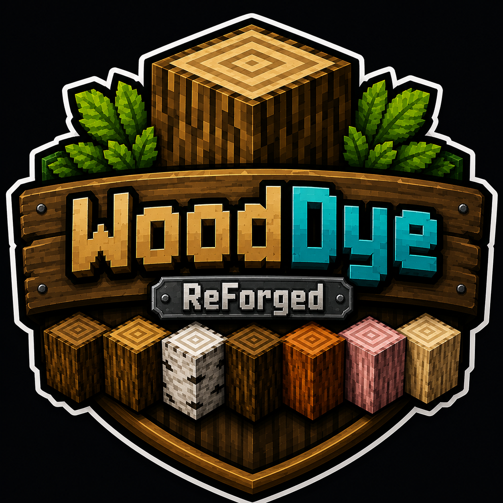
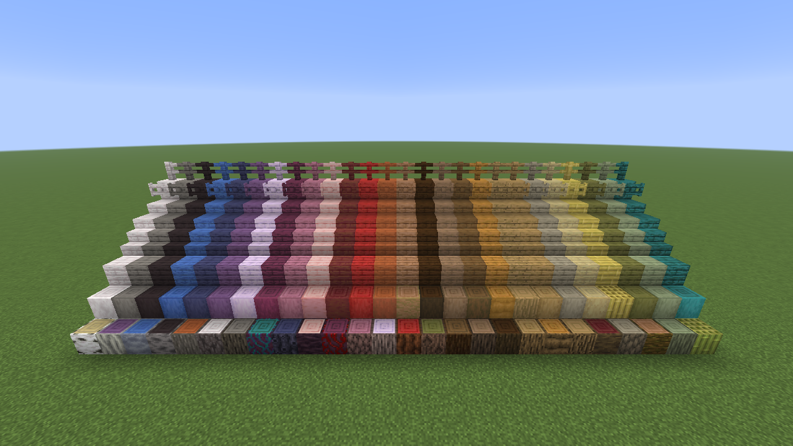
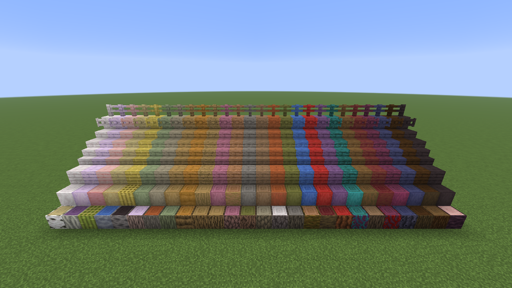
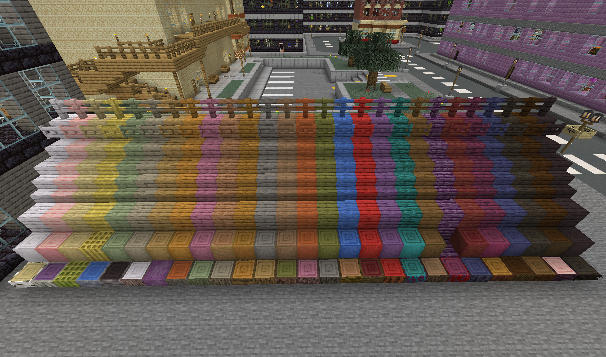

<p align="center">
  
</p>

# WoodDye ReForged

*No mod does wood more good!* Stain your wood with dyes, bleach it with bone meal, and fireproof it with magma cream.

A modern **NeoForge** rewrite of the classic [WoodDye](https://github.com/Sablednah/WoodDye) Bukkit plugin.

| | |
|---|---|
| License | MIT |
| Side | Server-side logic; the client needs it installed too (it adds blocks) |

One build per Minecraft line, each on its own branch; the jar name says which it is for.

| Minecraft | Loader | Java | Branch | Woods |
|-----------|--------|------|--------|-------|
| 26.3 | NeoForge 26.3.0.33-beta – .36 | 25 | `mc26.3` | 11 — adds **poplar** |
| 26.2 | NeoForge 26.2 | 25 | `mc26.2` | 10 |
| 26.1 | NeoForge 26.1 | 25 | `mc26.1` | 10 |
| 1.21.11 | NeoForge 21.11 | 21 | `main` | 10 |
| 1.21.1 | NeoForge 21.1 | 21 | `mc1.21.1` | 9 — no pale oak, and no shelves to dye |
| 1.20.1 | **Forge** 47 | 17 | `mc1.20.1` | 9 — as 1.21.1; no in-game config screen (Forge has none), so edit the TOML |

"Woods" counts the vanilla woods that can be fireproofed. Any wood in the game can be dyed, including
crimson and warped and woods from other mods, if you switch them on — see
[Which woods, and in what order](#which-woods-and-in-what-order).

## Install

Drop `wooddye-<version>+mc<minecraft>.jar` into `mods/` on both the server and the client. No
dependencies.

## What it does

Right-click a wooden block with a dye to shift it one step along a light→dark "wood shade" chain —
no crafting, no block breaking, done in place:

```
Pale Oak → Cherry → Birch → Bamboo → Oak → Jungle → Acacia → Spruce → Mangrove → Dark Oak
```

That order is not a list anyone wrote down: it is **measured** from each wood's texture, so a wood
added by a later Minecraft or by another mod finds its own place in it. See
[Which woods, and in what order](#which-woods-and-in-what-order).

- **Darken** one step with **black** or **brown** dye.
- **Lighten** one step with **white** or **light gray** dye, or **bone meal**.
- **Fireproof** wood by right-clicking it with **Magma Cream** — it becomes a matching `fireproof_*`
  block that will not burn or catch fire. Fireproof wood is still fully dyeable.
- **Un-fireproof** it again by right-clicking with a **Wet Sponge**, which soaks the magma cream back
  out and returns the plain vanilla wood (always available, even if fireproofing is disabled).

Both also work **on the crafting bench**, for wood still in your bag — **eight around one**, laid out
like vanilla's stained glass:

| Recipe | Gives |
|--------|-------|
| 8 × any wooden block around **Magma Cream** | 8 × its fireproof form |
| 8 × any fireproof block around **Wet Sponge** | 8 × the plain wood back — **and the sponge**, which is not consumed |

So the bench is how you treat a stack, and the right-click is how you treat one. The sponge comes
back wet by default and works indefinitely; set `spongeDries` to hand back a dry **Sponge** instead,
which must be re-soaked between uses.

The magma cream recipes obey the `fireProof` option: switch it off and there is *no* route to
fireproof wood, in world or on the bench. Restoring with a sponge is never blocked, so fireproofing
is always reversible.

Every successful treatment plays a particle + sound and shows a configurable action-bar message.

### What can be treated

| Form | Dye | Fireproof |
|------|-----|-----------|
| Planks, slabs, stairs | ✅ | ✅ |
| Logs, stripped logs, wood, stripped wood | ✅ | ✅ |
| Fences, fence gates | ✅ | ✅ |
| Doors, trapdoors | ✅ | ✅ |
| Pressure plates, buttons | ✅ | ✅ |
| Signs (standing, wall, hanging) | ✅ | — *(already fireproof in vanilla)* |
| Shelves | ✅ | — *(already fireproof in vanilla)* |

Blocks that **do something when you right-click them** — gates, doors, trapdoors, buttons, signs and
shelves — are only dyed when you **sneak** + right-click, so an ordinary click still just opens,
presses, or edits them. Everything else dyes on a plain right-click.

A door is re-dyed as a whole (both halves), a sign keeps its text, and a shelf is only dyed while
**empty**, so nothing it holds can be lost.

*(Every wood has log forms. Bamboo's are `bamboo_block` / `stripped_bamboo_block` — its pillar
equivalent of a log; it has no all-bark "wood" form.)*

### Which woods, and in what order

WoodDye does not keep a list of woods. It reads them from **block tags**: it owns one tag per form —
`#wooddye:dyeable/planks`, `…/slabs`, `…/stairs`, `…/logs`, `…/fences`, `…/fence_gates`, `…/doors`,
`…/trapdoors`, `…/pressure_plates`, `…/buttons`, `…/signs`, `…/wall_signs`, `…/hanging_signs`,
`…/wall_hanging_signs`, `…/shelves` — and each ships as nothing more than a pointer at the vanilla
tag (`#minecraft:planks`, `#minecraft:wooden_slabs`, …). Blocks are grouped into a wood by name:
`oak_planks`, `oak_slab` and `stripped_oak_log` are all *oak*.

- **Vanilla woods** work out of the box, including any a newer Minecraft adds.
- **Modded woods** are picked up automatically if the mod tags its blocks the standard way — switch
  on `moddedWoods`. They can be dyed, to and from vanilla woods; they cannot yet be fireproofed.
- **Crimson and warped** are off by default (`netherWoods`): by lightness, teal warped planks land
  between acacia and spruce, which is a surprise mid-way through darkening a floor.
- Leave a wood, or a whole mod, out with `excludedWoods`; or as a pack author, add to or remove from
  the `wooddye:dyeable/*` tags in a datapack.

**The order is measured.** Each wood's plank texture (and, for logs, its bark texture) is averaged
to a single colour, and the chain is sorted on it:

- `dyeOrder = SHADE` (default) — lightest to darkest.
- `dyeOrder = RAINBOW` — around the colour wheel. Woods too grey to have a real hue (pale oak) come
  first, lightest to darkest; the rest follow by hue. With the nether woods on, vanilla runs
  Pale Oak → Crimson → Cherry → Mangrove → Acacia → Jungle → Dark Oak → Spruce → Oak → Birch →
  Bamboo → Warped.

Vanilla textures are measured when the mod is built; a modded wood's is read from that mod's own jar
when the server starts, which works on a dedicated server too. If a texture cannot be found the
block's map colour stands in. `/wooddye woods` prints the resulting order, `/wooddye showcase`
builds it so you can look at it, and `toneOverrides` replaces any measurement you disagree with.

Both pictures below are `/wooddye showcase` on Minecraft 26.2 with Biomes O' Plenty installed and
`moddedWoods` and `netherWoods` on — 26 woods, none of them listed anywhere in the mod. The front
row is logs in bark order; behind it stripped logs, planks, stairs, slabs, fence gates and fences in
plank order.

`dyeOrder = RAINBOW`:



`dyeOrder = SHADE`, lightest to darkest — correct by lightness, and the reason coloured woods want
the rainbow option:



And the same command on **1.20.1 Forge** in a CityWorld street, with Biomes O' Plenty, Alex's Caves
and Cataclysm installed — the one gap is Cataclysm's chorus wood, which has no stripped log:



The dye→wood conversions are also available as **shapeless crafting recipes** (any wood block + dye)
for every form above except logs — a log's bark and end-grain run in different colour orders, a
choice only the in-world click can make:

| Dye | Wood | | Dye | Wood |
|-----|------|-|-----|------|
| White | Birch | | Black | Dark Oak |
| Light Gray | Oak | | Pink | Cherry |
| Yellow | Jungle | | Red | Mangrove |
| Orange | Acacia | | Lime | Bamboo |
| Brown | Spruce | | Gray | Pale Oak |
| Green | Poplar *(26.3+)* | | | |

**Dyeing preserves fireproofing:** dye a *fireproof* block on the bench and you get the fireproof
form of the new wood. Only the magma cream / wet sponge decide whether wood is fireproof.

### Fireproof wood builds fireproof everything

Fireproof blocks have the **same crafting recipes as their vanilla originals** — fireproof logs make
fireproof planks, which make fireproof slabs, stairs, fences, doors, and the rest, at vanilla ratios.
Every *wooden* ingredient must itself be fireproof, so fireproofing can never be crafted into
existence; it only ever enters via magma cream. (Non-wood parts, like the sticks in a fence, are
ordinary — there is no fireproof stick.)

An **axe strips fireproof logs and wood** just as it strips the vanilla ones, keeping both the
fireproofing and the block's orientation. (Data-only on the NeoForge lines: the
`neoforge:strippables` data map up to 26.2, and vanilla's own block transformers through
`neoforge:transformables` from 26.3. Forge 1.20.1 has no data maps, so that line does it in code.)

Fireproof blocks also join the vanilla wood tags (`#minecraft:planks`, `#minecraft:wooden_doors`,
`#minecraft:mineable/axe`, …), so they mine and build like the wood they copy — but never the
`*_that_burn` tags. One consequence worth knowing: because they are in `#minecraft:planks`, a vanilla
recipe that takes any planks (a crafting table, say) accepts fireproof ones and gives an ordinary
result. Use a wet sponge if you want the plain wood back deliberately.

## Configuration (`config/wooddye-common.toml`)

| Option | Default | Purpose |
|--------|---------|---------|
| `useItems` | `false` | Consume the dye / magma cream when treating a block in world (never in creative). A Wet Sponge only **dries out** rather than being used up. |
| `fireProof` | `true` | Enable Magma Cream fireproofing — both in world and on the bench. |
| `spongeDries` | `false` | Hand back a dry Sponge instead of the Wet Sponge when restoring wood on the bench. |
| `logOrder` | `INTELLIGENT` | Dye order for logs (see below). |
| `dyeOrder` | `SHADE` | Sort woods light→dark (`SHADE`) or around the colour wheel (`RAINBOW`). |
| `moddedWoods` | `false` | Include woods from other mods in the dye order. |
| `netherWoods` | `false` | Include crimson and warped (anything in `#minecraft:non_flammable_wood`). |
| `excludedWoods` | `[]` | Woods left out: a mod id (`"biomesoplenty"`) or one wood (`"minecraft:bamboo"`). |
| `toneOverrides` | `[]` | Replace a measured colour: `"<block id>=#rrggbb"`. A planks block moves the wood in the plank order, a log block in the bark order. |
| `showEffects` | `true` | Play a particle + sound when wood is treated. |
| `showMessage` | `true` | Show an action-bar message on success. |
| `message` | `&aWood treated!` | The message text — supports `&` colour codes and `%P` (player name). |
| `debugMode` | `false` | Extra logging. |

Settings are read live; edits to the TOML apply on save. You can also edit them **in-game** from the
Mods menu → WoodDye ReForged → **Config** (single-player / LAN host), where each option has a readable name
and its comment above as the tooltip. On a dedicated server, edit `config/wooddye-common.toml`
directly.

*(Those names come from `wooddye.configuration.*` keys in the lang file — NeoForge derives the key
from the option name, so a new option only needs a lang entry adding to `gen_resources.py`.)*

### Log dye order

A log's **bark** (sides) and **end-grain rings** (top/bottom) run through different colour orders, so
one fixed order can only look right on one of them. `logOrder` chooses how logs step:

- **`SAME_AS_PLANKS`** — by inner-wood colour, matching planks (looks right on the ends).
- **`BARK`** — by bark colour (looks right on the sides). Measured like the plank order:
  Birch → Bamboo → Acacia → Oak → Pale Oak → Jungle → Mangrove → Dark Oak → Spruce → Cherry.
- **`INTELLIGENT`** (default) — picks per click: clicking a **side** uses bark order, clicking a
  **top/bottom** uses wood order. The log keeps its orientation.

## Commands & permissions

- `/wooddye reload` — re-reads config (op / permission level `LEVEL_GAMEMASTERS`).
- `/wooddye woods` — lists the woods in dye order, plank and bark, with each one's measured
  lightness and a note where a colour came from the config or a map colour instead (op).
- `/wooddye showcase` — builds every dyeable wood side by side in dye order where you stand (26
  woods need a 26 × 8 × 7 space; it replaces what is there), and replies with a `/tp` to the spot
  that frames it (op).
- Permission node `wooddye.candye` — may a player dye wood in-world (default: allow). Install a
  permissions manager (e.g. LuckPerms for NeoForge) to restrict it per group.

## Building from source

Requires the JDK for the line you are building: 17 for 1.20.1, 21 for 1.21.x, 25 for 26.x. Standard
ModDevGradle setup (its legacy-Forge flavour on 1.20.1):

```
./gradlew build             # jar in build/libs/wooddye-<version>+mc<minecraft>.jar
./gradlew runClient         # dev client
./gradlew runServer         # dev dedicated server
python3 tools/gen_resources.py   # regenerate assets/data under src/main/resources
```

NeoForge 21.11 removed the client model-generator datagen classes, so the mod's blockstates, item
models, loot tables, tags, recipes and lang are generated by `tools/gen_resources.py` (cloned from
the vanilla client jar) and committed under `src/main/resources`. Re-run it after changing the block
list in `core/WoodType.java`. It needs [Pillow](https://pypi.org/project/pillow/) to read textures,
and it reads `minecraft_version` from `gradle.properties` — it works from that version's client jar
and skips any wood, form or tag that version lacks.

### How it fits together

`core/WoodType.java` holds two things. Its `Form` enum is the single source of truth for the wooden
families (planks, slab, stairs, log, wood, fence, door, …): whether each gets a fireproof block,
whether it needs sneak-to-dye, which colour chain it follows, which tag finds it, and any special
in-world handling. The enum of woods around it is **only the fireproofing list** — the vanilla woods
that get `fireproof_*` blocks. Which woods can be *dyed* is discovered from tags at runtime.

| Path | Role |
|------|------|
| `core/WoodType.java` | The forms and their properties, and the woods that get fireproof blocks. **Start here.** |
| `core/Tone.java` | Averages a texture to one colour and expresses it as lightness / chroma / hue. |
| `core/DyeOrder.java` | Sorts woods by tone: light→dark, or around the colour wheel. |
| `registry/WoodDyeBlocks.java` | Registers a `fireproof_*` block per fireproof form × wood (128). |
| `registry/WoodDyeItems.java` | Their block items (doors get a `DoubleHighBlockItem`). |
| `neoforge/WoodFamilies.java` | Finds the woods in the `wooddye:dyeable/*` tags and resolves each one's tone. |
| `neoforge/TextureTones.java` | Reads a modded wood's texture out of its mod's jar and measures it. |
| `neoforge/WoodTransforms.java` | The lookup tables: dye chains, vanilla↔fireproof, sneak/door/sign/shelf sets. Rebuilt when tags or config reload. |
| `neoforge/WoodDyeInteractions.java` | The right-click behaviour. |
| `crafting/DelegatingShapedRecipe.java` | Base for the two recipes JSON can't express (below). |
| `tools/gen_resources.py` | Generates all assets/data by cloning vanilla's. Mirrors `WoodType.Form`. |

Almost every recipe is a plain vanilla type in JSON. Two need a Java serializer, because they do one
thing a shaped recipe cannot: `wooddye:fireproofing` refuses to match while `fireProof` is off, and
`wooddye:sponge_restore` returns the sponge rather than eating it. Both delegate everything else to a
real `ShapedRecipe` and report themselves as `minecraft:crafting`, so the recipe book and JEI treat
them as ordinary.

`gen_resources.py` clones rather than authors: it copies each vanilla blockstate and item model
verbatim (pointing at vanilla's models — the mod ships no textures), and remaps the ids in vanilla's
loot tables and recipes. That inherits the fiddly parts for free, like a door dropping only from its
lower half and a double slab dropping two. Keep the script's form list in step with `WoodType.Form`.

## Credits & licence

Originally a Bukkit plugin by **Sablednah** ([Sablednah/WoodDye](https://github.com/Sablednah/WoodDye)),
rewritten from the ground up for NeoForge. Released under the **MIT** licence — the original's
CC-BY-NC-ND terms were relicensed by the same author.
